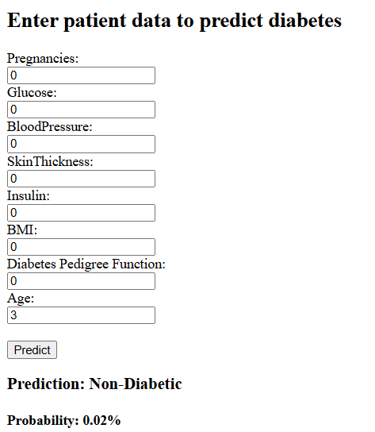

# Diabetes Prediction Web App Using Logistic Regression

This repository contains a machine learning project that predicts diabetes based on patient medical data using a Logistic Regression model. The project includes exploratory data analysis, data preprocessing, model training, and a Flask-based web application for making real-time predictions. The entire application is also dockerized for easy deployment.

## Project Overview

This project uses the Pima Indians Diabetes Dataset to predict whether a patient has diabetes. The model of choice is Logistic Regression, trained on standardized patient data. The repository contains notebooks for exploratory data analysis and model development, and a Flask web application for interactive predictions via a user-friendly interface.

## SCREENSHOT

## Dataset

- Dataset: Pima Indians Diabetes Dataset  
- Features:
  - Pregnancies  
  - Glucose  
  - Blood Pressure  
  - Skin Thickness  
  - Insulin  
  - BMI  
  - Diabetes Pedigree Function  
  - Age  
- Target: Outcome (0 = Non-diabetic, 1 = Diabetic)

## Technologies Used

- Python 3.11  
- Jupyter Notebooks  
- pandas, numpy  
- scikit-learn  
- matplotlib, seaborn  
- Flask  
- joblib  
- Docker  

# Model Training & Evaluation

 
- Pre Processing :
  - Dataset loaded from CSV

  - Features and target separated

  - Train-test split (80% train, 20% test)

- #### Model: Logistic Regression from scikit-learn

- Evaluation Metrics:

  - Accuracy

  - ROC AUC Score

  - Classification Report (Precision, Recall, F1-Score)

  - Confusion Matrix (visualized with seaborn heatmap)

# Web Application
  - Developed using Flask

  - Loads saved Logistic Regression model and scaler via joblib

  - Accepts input for all features via an HTML form

  - Scales inputs before prediction

  - Returns prediction (Diabetic / Non-Diabetic) and probability score

  - Error handling for invalid inputs

  - Template engine: Jinja2 for dynamic rendering of results

# Dockerization
  - Dockerfile included for containerizing the Flask app

  - Based on Python 3.11 slim image

  - Copies requirements and installs dependencies

  - Copies app code, templates, and model files into container

  - Exposes port 5000

